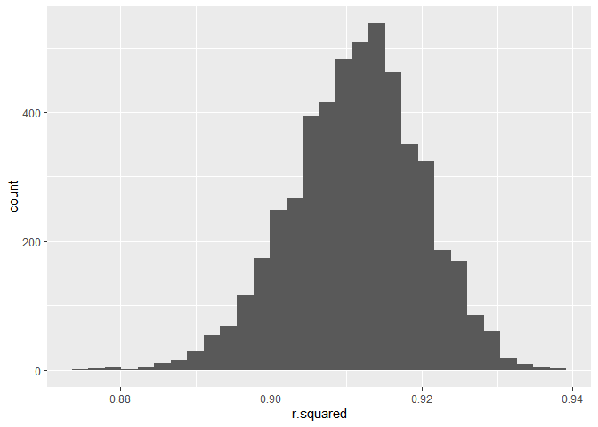
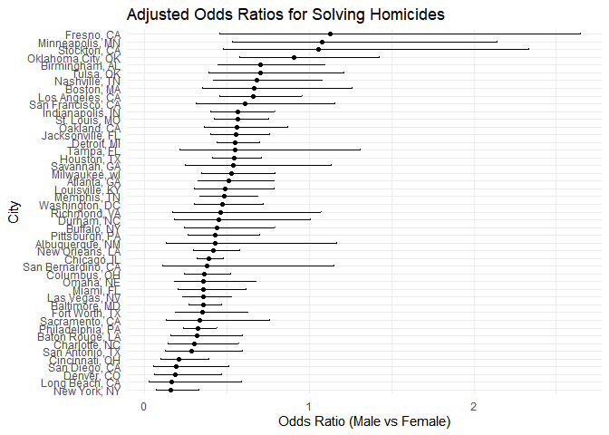
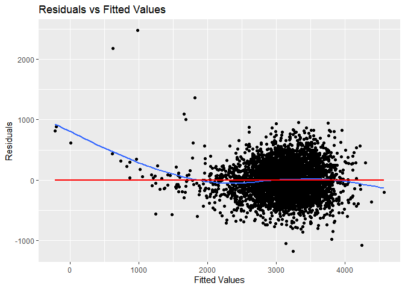
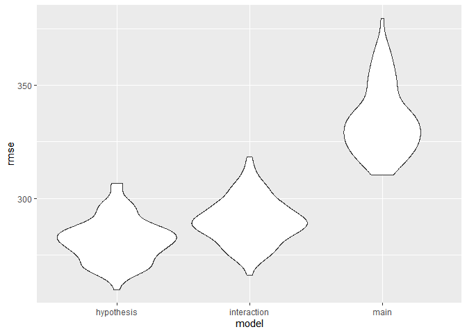

p8105_hw6_ws2721
================
2024-11-21

``` r
library(tidyverse)
```

    ## ── Attaching core tidyverse packages ──────────────────────── tidyverse 2.0.0 ──
    ## ✔ dplyr     1.1.4     ✔ readr     2.1.5
    ## ✔ forcats   1.0.0     ✔ stringr   1.5.1
    ## ✔ ggplot2   3.5.1     ✔ tibble    3.2.1
    ## ✔ lubridate 1.9.3     ✔ tidyr     1.3.1
    ## ✔ purrr     1.0.2     
    ## ── Conflicts ────────────────────────────────────────── tidyverse_conflicts() ──
    ## ✖ dplyr::filter() masks stats::filter()
    ## ✖ dplyr::lag()    masks stats::lag()
    ## ℹ Use the conflicted package (<http://conflicted.r-lib.org/>) to force all conflicts to become errors

``` r
library(broom)
library(modelr)
```

    ## 
    ## Attaching package: 'modelr'
    ## 
    ## The following object is masked from 'package:broom':
    ## 
    ##     bootstrap

``` r
library(mgcv)
```

    ## Loading required package: nlme
    ## 
    ## Attaching package: 'nlme'
    ## 
    ## The following object is masked from 'package:dplyr':
    ## 
    ##     collapse
    ## 
    ## This is mgcv 1.9-1. For overview type 'help("mgcv-package")'.

``` r
set.seed(1)
```

# Problem 1

``` r
weather_df = 
  rnoaa::meteo_pull_monitors(
    c("USW00094728"),
    var = c("PRCP", "TMIN", "TMAX"), 
    date_min = "2017-01-01",
    date_max = "2017-12-31") %>%
  mutate(
    name = recode(id, USW00094728 = "CentralPark_NY"),
    tmin = tmin / 10,
    tmax = tmax / 10) %>%
  select(name, id, everything())
```

    ## using cached file: C:\Users\wshin\AppData\Local/R/cache/R/rnoaa/noaa_ghcnd/USW00094728.dly

    ## date created (size, mb): 2024-09-26 10:12:49.333323 (8.452)

    ## file min/max dates: 1869-01-01 / 2022-12-31

download data

``` r
weather_df = weather_df |> 
  modelr::bootstrap(n = 5000) |> 
  mutate(slr_m = map(strap, \(df) lm(tmax ~ tmin, data = df)),
         slr_r = map(slr_m, broom::tidy),
         slr_g = map(slr_m, broom::glance))
```

``` r
weather_rsq = weather_df |> 
  select(-strap, -slr_m, -slr_r) |> 
  unnest(slr_g) |> 
  select(.id, r.squared)

ggplot(weather_rsq, aes(x = r.squared)) +
  geom_histogram()
```

    ## `stat_bin()` using `bins = 30`. Pick better value with `binwidth`.

<!-- -->

# Problem 2

``` r
h_data = read_csv("homicide-data.csv") |> 
  mutate(city_state = paste(city, state, sep = ", ")) |> 
  filter(!city_state %in% c("Dallas, TX", 
                            "Phoenix, AZ", 
                            "Kansas City, MO", 
                            "Tulsa, AL")) |> 
  filter(victim_race %in% c("White", 
                            "Black")) |> 
  mutate(victim_age = as.numeric(victim_age),
         victim_race = as.factor(victim_race),
         victim_sex = as.factor(victim_sex)) |> 
  mutate(solved = as.factor(case_when(
      disposition == "Closed by arrest" ~ 1,
      disposition == "Closed without arrest" ~ 1,
      disposition == "Open/No arrest" ~ 0
    ))) |> 
  drop_na(victim_age) |> 
  filter(victim_sex != "Unknown")
```

    ## Rows: 52179 Columns: 12
    ## ── Column specification ────────────────────────────────────────────────────────
    ## Delimiter: ","
    ## chr (9): uid, victim_last, victim_first, victim_race, victim_age, victim_sex...
    ## dbl (3): reported_date, lat, lon
    ## 
    ## ℹ Use `spec()` to retrieve the full column specification for this data.
    ## ℹ Specify the column types or set `show_col_types = FALSE` to quiet this message.

    ## Warning: There was 1 warning in `mutate()`.
    ## ℹ In argument: `victim_age = as.numeric(victim_age)`.
    ## Caused by warning:
    ## ! NAs introduced by coercion

``` r
summary(h_data)
```

    ##      uid            reported_date      victim_last        victim_first      
    ##  Length:39362       Min.   :20070101   Length:39362       Length:39362      
    ##  Class :character   1st Qu.:20100412   Class :character   Class :character  
    ##  Mode  :character   Median :20130114   Mode  :character   Mode  :character  
    ##                     Mean   :20124440                                        
    ##                     3rd Qu.:20150920                                        
    ##                     Max.   :20171231                                        
    ##                                                                             
    ##  victim_race     victim_age       victim_sex        city          
    ##  Black:33091   Min.   :  0.00   Female : 5830   Length:39362      
    ##  White: 6271   1st Qu.: 22.00   Male   :33532   Class :character  
    ##                Median : 28.00   Unknown:    0   Mode  :character  
    ##                Mean   : 31.93                                     
    ##                3rd Qu.: 40.00                                     
    ##                Max.   :102.00                                     
    ##                                                                   
    ##     state                lat             lon          disposition       
    ##  Length:39362       Min.   :25.73   Min.   :-122.51   Length:39362      
    ##  Class :character   1st Qu.:35.04   1st Qu.: -90.26   Class :character  
    ##  Mode  :character   Median :38.90   Median : -86.85   Mode  :character  
    ##                     Mean   :37.54   Mean   : -88.86                     
    ##                     3rd Qu.:40.67   3rd Qu.: -80.84                     
    ##                     Max.   :45.05   Max.   : -71.01                     
    ##                     NA's   :42      NA's   :42                          
    ##   city_state        solved   
    ##  Length:39362       0:18074  
    ##  Class :character   1:21288  
    ##  Mode  :character            
    ##                              
    ##                              
    ##                              
    ## 

Made a data set that includes the “city_state” variable and a binary
variable indicating whether the homicide is solved. Omitted the cities
that is Dallas, Phoenix, Kansas City, and Tulsa. Also changed the
varibles by their type and dropped all the NAs.

``` r
baltimore_data = h_data |> 
  filter(city_state == "Baltimore, MD")

baltimore = glm(solved ~ victim_age + victim_sex + victim_race, data = baltimore_data, family = binomial())

baltimore_result = broom::tidy(baltimore, conf.int = TRUE, exponentiate = TRUE)
baltimore_result |> 
  filter(term == "victim_sexMale")
```

    ## # A tibble: 1 × 7
    ##   term           estimate std.error statistic  p.value conf.low conf.high
    ##   <chr>             <dbl>     <dbl>     <dbl>    <dbl>    <dbl>     <dbl>
    ## 1 victim_sexMale    0.355     0.143     -7.26 3.74e-13    0.267     0.468

The adjusted odds ratio for solving homicides comparing male victims to
female victims in blatimore is:

aOR: 0.355 95% CI: 0.267-0.468

``` r
all_city = h_data |> 
  group_by(city_state) |> 
  nest() |> 
  mutate(
    model = map(data, ~glm(solved ~ victim_age + victim_sex + victim_race, data = ., family = binomial())),
    results = map(model, ~broom::tidy(., conf.int = TRUE, exponentiate = TRUE))
  ) |> 
  unnest(cols = results) |> 
  filter(term == "victim_sexMale") |> 
  select(city_state, estimate, conf.low, conf.high)
```

Ran the glm fuction for all city data and extracted the odds ratio and
95% CI for solving homicides comparing male victims to female victims.

``` r
all_city = all_city |> 
  mutate(city_state = factor(city_state, levels = city_state))

ggplot(all_city, aes(x = reorder(city_state,estimate), y = estimate)) +
  geom_point() +
  geom_errorbar(aes(ymin = conf.low, ymax = conf.high), width = 0.2) +
  coord_flip() +
  labs(title = "Adjusted Odds Ratios for Solving Homicides",
       x = "City",
       y = "Odds Ratio (Male vs Female)") +
  theme_minimal()
```

<!-- -->

The highest odds of male becoming a victim is Fresno, CA and the lowest
odds of male becoming a victim is New York, NY. We could see that the
population density and the size of the city doesn’t directly correlates
to the sex of the victim.

# Problem 3

``` r
bw = read_csv("birthweight.csv") |> 
  mutate(
    babysex = as.factor(babysex),
    malform = as.factor(malform),
    frace = as.factor(frace),
    mrace = as.factor(mrace)
  )
```

    ## Rows: 4342 Columns: 20
    ## ── Column specification ────────────────────────────────────────────────────────
    ## Delimiter: ","
    ## dbl (20): babysex, bhead, blength, bwt, delwt, fincome, frace, gaweeks, malf...
    ## 
    ## ℹ Use `spec()` to retrieve the full column specification for this data.
    ## ℹ Specify the column types or set `show_col_types = FALSE` to quiet this message.

``` r
summary(bw)
```

    ##  babysex      bhead          blength           bwt           delwt      
    ##  1:2230   Min.   :21.00   Min.   :20.00   Min.   : 595   Min.   : 86.0  
    ##  2:2112   1st Qu.:33.00   1st Qu.:48.00   1st Qu.:2807   1st Qu.:131.0  
    ##           Median :34.00   Median :50.00   Median :3132   Median :143.0  
    ##           Mean   :33.65   Mean   :49.75   Mean   :3114   Mean   :145.6  
    ##           3rd Qu.:35.00   3rd Qu.:51.00   3rd Qu.:3459   3rd Qu.:157.0  
    ##           Max.   :41.00   Max.   :63.00   Max.   :4791   Max.   :334.0  
    ##     fincome      frace       gaweeks      malform     menarche    
    ##  Min.   : 0.00   1:2123   Min.   :17.70   0:4327   Min.   : 0.00  
    ##  1st Qu.:25.00   2:1911   1st Qu.:38.30   1:  15   1st Qu.:12.00  
    ##  Median :35.00   3:  46   Median :39.90            Median :12.00  
    ##  Mean   :44.11   4: 248   Mean   :39.43            Mean   :12.51  
    ##  3rd Qu.:65.00   8:  14   3rd Qu.:41.10            3rd Qu.:13.00  
    ##  Max.   :96.00            Max.   :51.30            Max.   :19.00  
    ##     mheight          momage     mrace        parity            pnumlbw 
    ##  Min.   :48.00   Min.   :12.0   1:2147   Min.   :0.000000   Min.   :0  
    ##  1st Qu.:62.00   1st Qu.:18.0   2:1909   1st Qu.:0.000000   1st Qu.:0  
    ##  Median :63.00   Median :20.0   3:  43   Median :0.000000   Median :0  
    ##  Mean   :63.49   Mean   :20.3   4: 243   Mean   :0.002303   Mean   :0  
    ##  3rd Qu.:65.00   3rd Qu.:22.0            3rd Qu.:0.000000   3rd Qu.:0  
    ##  Max.   :77.00   Max.   :44.0            Max.   :6.000000   Max.   :0  
    ##     pnumsga      ppbmi            ppwt           smoken           wtgain      
    ##  Min.   :0   Min.   :13.07   Min.   : 70.0   Min.   : 0.000   Min.   :-46.00  
    ##  1st Qu.:0   1st Qu.:19.53   1st Qu.:110.0   1st Qu.: 0.000   1st Qu.: 15.00  
    ##  Median :0   Median :21.03   Median :120.0   Median : 0.000   Median : 22.00  
    ##  Mean   :0   Mean   :21.57   Mean   :123.5   Mean   : 4.145   Mean   : 22.08  
    ##  3rd Qu.:0   3rd Qu.:22.91   3rd Qu.:134.0   3rd Qu.: 5.000   3rd Qu.: 28.00  
    ##  Max.   :0   Max.   :46.10   Max.   :287.0   Max.   :60.000   Max.   : 89.00

Cleaned the data and assigned the factor variables that should be a
factor for analysis. Also checked the data to remove such as frace = 9
(Unknown), but there wasn’t any values to remove.

``` r
model_h = lm(
  bwt ~ momage + mheight + delwt + smoken + gaweeks + blength + bhead + babysex,
  data = bw)

summary(model_h)
```

    ## 
    ## Call:
    ## lm(formula = bwt ~ momage + mheight + delwt + smoken + gaweeks + 
    ##     blength + bhead + babysex, data = bw)
    ## 
    ## Residuals:
    ##      Min       1Q   Median       3Q      Max 
    ## -1178.09  -182.87    -8.66   175.88  2477.23 
    ## 
    ## Coefficients:
    ##               Estimate Std. Error t value Pr(>|t|)    
    ## (Intercept) -6719.3648   135.0158 -49.767  < 2e-16 ***
    ## momage          5.3550     1.1169   4.795 1.68e-06 ***
    ## mheight         7.1535     1.7732   4.034 5.57e-05 ***
    ## delwt           1.6975     0.2152   7.889 3.83e-15 ***
    ## smoken         -2.5008     0.5818  -4.298 1.76e-05 ***
    ## gaweeks        13.6471     1.4950   9.128  < 2e-16 ***
    ## blength        78.1835     2.0679  37.808  < 2e-16 ***
    ## bhead         136.4479     3.5237  38.723  < 2e-16 ***
    ## babysex2       30.4659     8.6994   3.502 0.000466 ***
    ## ---
    ## Signif. codes:  0 '***' 0.001 '**' 0.01 '*' 0.05 '.' 0.1 ' ' 1
    ## 
    ## Residual standard error: 280.6 on 4333 degrees of freedom
    ## Multiple R-squared:  0.7003, Adjusted R-squared:  0.6997 
    ## F-statistic:  1265 on 8 and 4333 DF,  p-value: < 2.2e-16

``` r
bw = bw |> 
  add_predictions(model_h) |> 
  add_residuals(model_h)


ggplot(bw, aes(x = pred, y = resid)) +
  geom_point() +
  geom_smooth(se = FALSE) +
  geom_smooth(se = FALSE, method = "lm", color = "red")+
  labs(
    title = "Residuals vs Fitted Values",
    x = "Fitted Values",
    y = "Residuals"
  )
```

    ## `geom_smooth()` using method = 'gam' and formula = 'y ~ s(x, bs = "cs")'
    ## `geom_smooth()` using formula = 'y ~ x'

<!-- -->

I wanted to concentrate more on the mother’s and baby’s biological
factor to determine the birth weight. I have included mom’s biological
characteristics such as age, height, and weight at delivery etc., I also
added the babies gestational age and baby’s length and head
circumference etc.

The smooth line seems to reside in the 0 mark, of the residuals
indicating that the model is somewhat effective to estimate the baby’s
birth weight by the variables in the model. It is not that effective
with babies with lower birth weight.

``` r
cv_df = crossv_mc(bw, 100) |> 
  mutate(train = map(train, as_tibble),
         test = map(test, as_tibble))

cv_df2 = cv_df |> 
  mutate(
  model_h_t = map(train, ~lm(bwt ~ momage + mheight + delwt + smoken + gaweeks + blength + bhead + babysex,
  data = .x)),
  model_m_t = map(train, ~lm(bwt ~ blength + gaweeks, data=.x)),
  model_i_t = map(train, ~lm(bwt ~ bhead * blength * babysex, data = .x))) |> 
  mutate(rmse_hypothesis = map2_dbl(model_h_t, test, rmse),
         rmse_main = map2_dbl(model_m_t, test, rmse),
         rmse_interaction = map2_dbl(model_i_t, test, rmse))
```

I will be creating 100 testing data sets for cross-validation. Then fit
3 models in to the training data set which is my hypothesis model, main
effects model and interaction model.

``` r
cv_df2 |>  
  select(starts_with("rmse")) |>  
  pivot_longer(
    everything(),
    names_to = "model", 
    values_to = "rmse",
    names_prefix = "rmse_"
  ) |> 
  ggplot(aes(x = model, y = rmse)) + 
  geom_violin()
```

<!-- -->

The cross validation results tells me that the including biological
factors of both mother and baby is shown to be a better estimation model
for baby’s birth weight compared to only assessing the baby’s
characteristic.

The rmse value of the hypothesis model was shown to be the lowest among
all three models.
